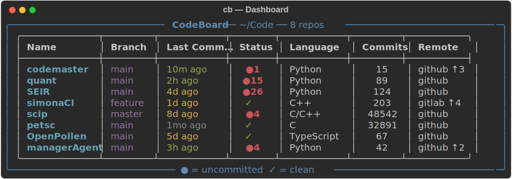
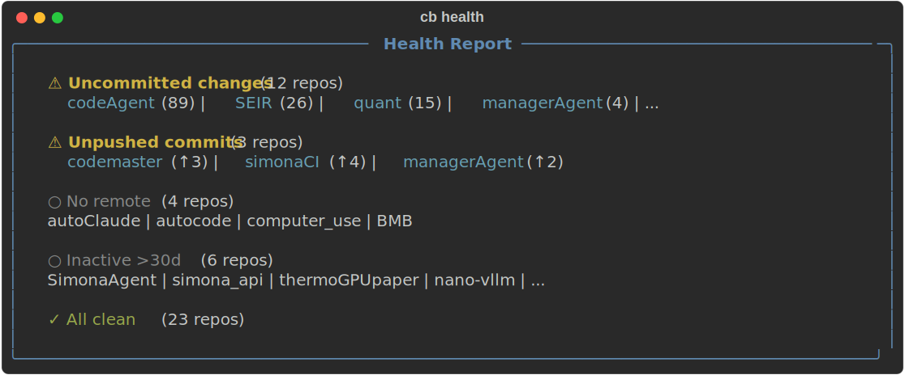
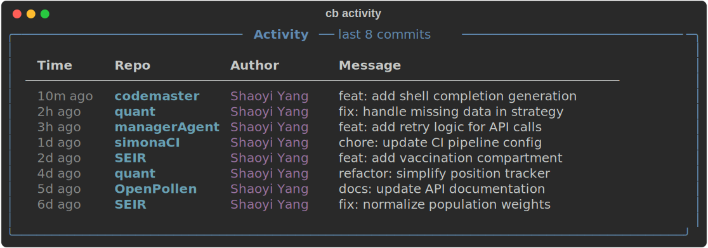
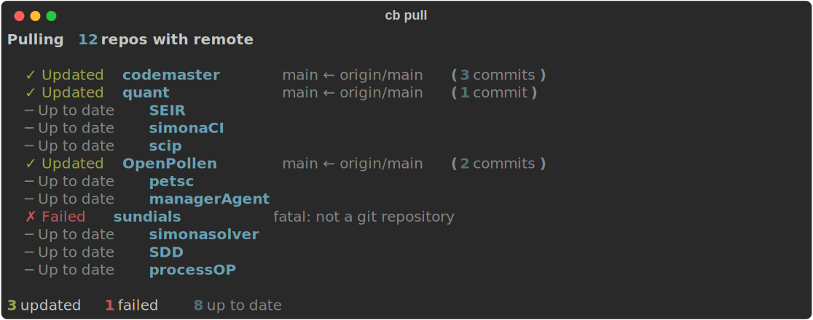
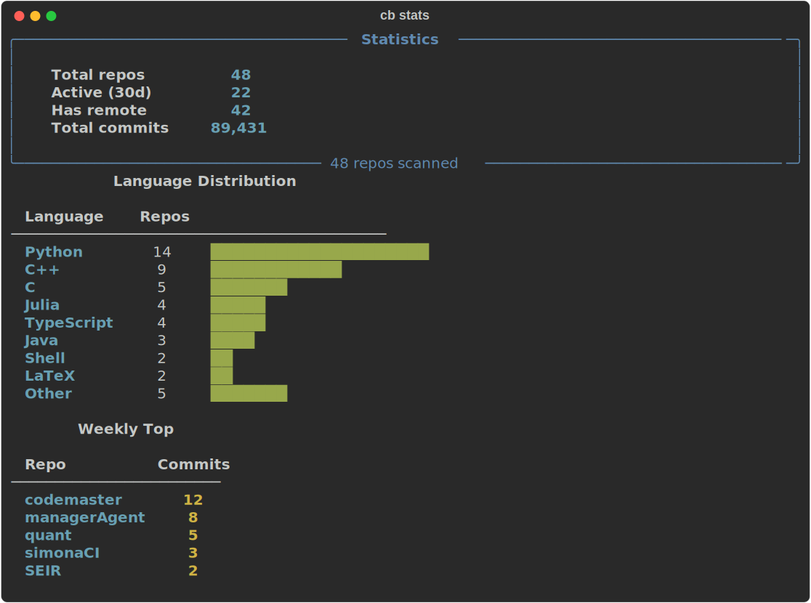
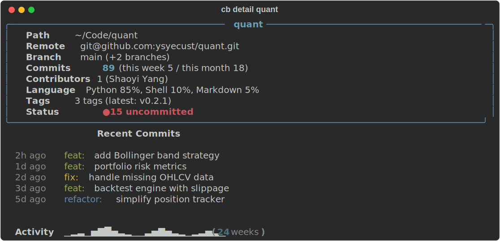
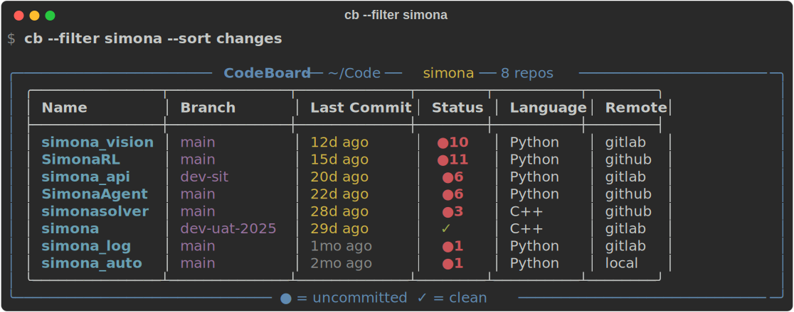
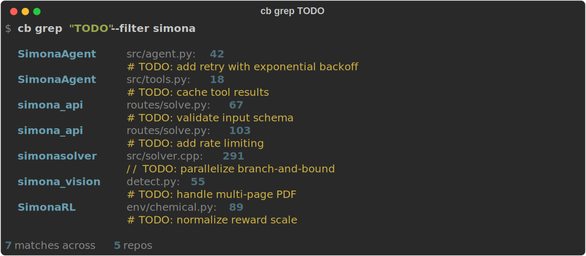

# 写了个命令行工具，一眼看清你所有 Git 仓库的状态

作为一个同时维护几十个项目的开发者，我每天都面临一个很朴素的问题：

> 我的哪些仓库有没提交的改动？哪些忘了推送？哪个项目上次是什么时候碰的？

`git status` 一次只能看一个仓库。当你有 40+ 个项目散落在 `~/Code` 下面时，逐个 cd 进去看状态是一件令人窒息的事。

所以我写了 **CodeBoard** —— 一个终端仪表盘，一条命令扫描你所有的 Git 仓库。

GitHub: https://github.com/ysyecust/codemaster

---

## 它长什么样

主仪表盘（`cb`）：



48 个仓库，扫描时间 ~1 秒。

## 核心功能

### 1. 健康检查 — `cb health`

一条命令告诉你所有"需要关注"的仓库：



再也不会忘记推送了。

### 2. 跨仓库活动 — `cb activity`

所有仓库的提交混在一条时间线上，看你最近几天在忙什么：



### 3. 批量操作

一键 pull 所有仓库：



还有更多批量命令：

```bash
cb push                        # 推送所有有 ahead 的仓库
cb commit myrepo -m "fix: xx"  # 快速提交
cb stash myrepo                # 快速暂存
cb grep "TODO"                 # 跨所有仓库搜代码
```

### 4. 统计概览 — `cb stats`



### 5. 单仓库详情 — `cb detail`



### 6. 过滤和排序



还支持更多组合：

```bash
cb --sort changes           # 按脏文件数排序
cb --watch 10               # 每 10 秒自动刷新
cb --json | jq '.[]'        # JSON 输出，方便管道
cb health --filter simona   # 全局选项可以放子命令后面
```

### 7. 跨仓库搜索 — `cb grep`



### 8. lazygit 联动

```bash
cb open myrepo log    # lazygit 直接打开某个仓库的提交历史
cb dirty              # 列出脏仓库，交互选一个打开
cb each               # 逐个处理所有脏仓库
```

`cb each` 是我最常用的 —— 一个个打开有改动的仓库，关掉 lazygit 自动跳下一个。

### 9. 代码图谱分析（可选）

如果你安装了 [GitNexus](https://github.com/nicobailon/gitnexus)，还能分析代码结构：

```bash
cb graph scip              # 图谱概览：30k 节点、52k 边
cb graph scip community    # Leiden 社区聚类
cb graph scip deps         # 跨模块依赖热点
cb graph scip report       # 生成 Obsidian 文档（Mermaid 图表）
```

---

## 安装

```bash
pip install git+https://github.com/ysyecust/codemaster.git
```

装完后 `cb` 和 `codeboard` 两个命令都可用。

或者直接跑：

```bash
python codeboard.py
```

依赖很少：Python 3.11+ 和 `rich`（终端美化库）。

## 一些设计决策

**单文件。** 整个工具就一个 `codeboard.py`，3000 多行。没有拆模块，没有包结构。好处是部署极简、阅读门槛低。

**快。** 每个仓库只发起 1 次 shell 调用（把 6-9 条 git 命令合并成一个 `sh -c`），8 路并行扫描。48 个仓库不到 1 秒。

**中英双语。** 166 个 i18n 键，`--lang en` 切英文，`--lang zh` 切中文，默认自动检测。

**配置可选。** 零配置直接用（默认扫描 `~/Code`），想定制跑个 `cb config` 生成 TOML 配置文件。

**安全。** pull 用 `--ff-only`，push 和 commit 默认需要确认，不会悄悄搞坏你的仓库。

---

## 适合谁

- 同时维护多个项目的开发者
- 用 Git 管理所有代码的人（包括笔记、论文、配置）
- lazygit 用户
- 喜欢终端工作流的人

如果你也受够了在几十个仓库之间 cd 来 cd 去，试试看。

⭐ **GitHub**: https://github.com/ysyecust/codemaster

MIT 开源，欢迎提 Issue 和 PR。
